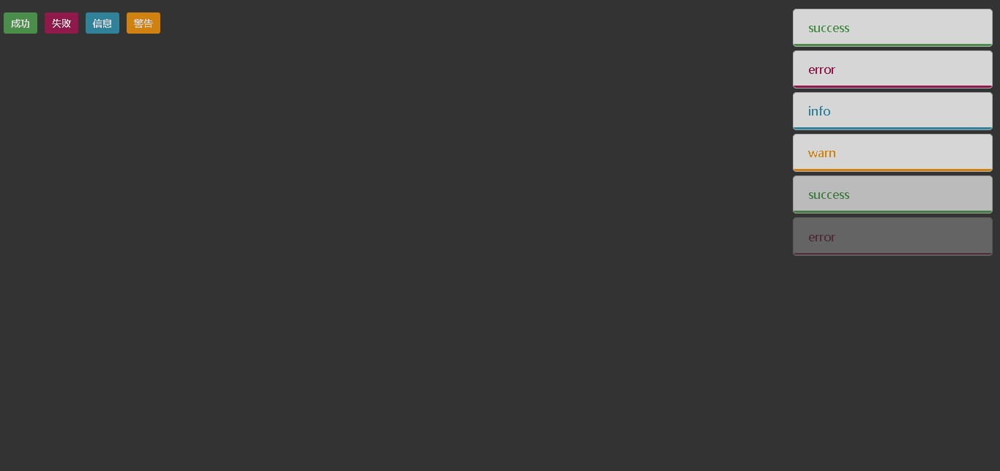
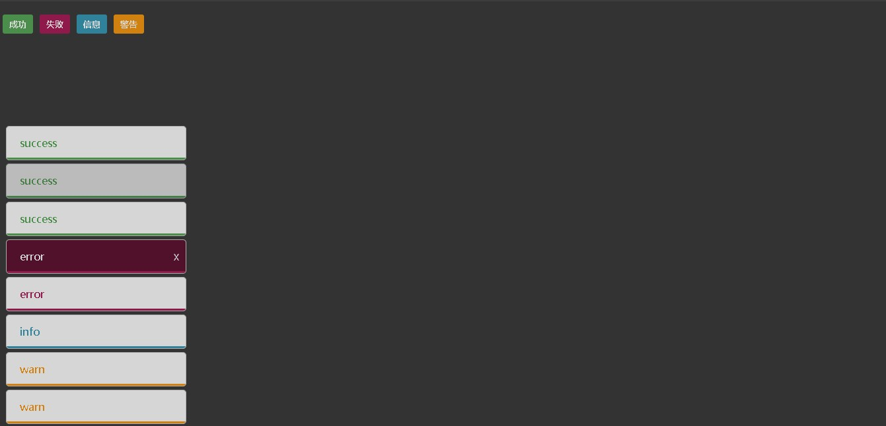
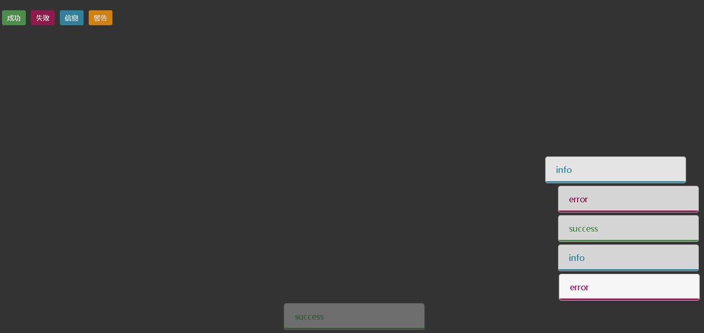

# mini-toastr
> 在深入使用[toastr]()后(一个基于Jquery生成弹窗的js类库)   
> 想开发一个纯js实现弹窗的类库。   
> 因此在深入学习其源码后，编写了这个小类库, 暂时称为`mini-toastr`。  
> 由于不算非常完善，暂时不发布到`npm`, 适用于需要`学习类库源码`的人群参考。

## 实现的功能
- [x] 支持支持debug调试信息
- [x] 支持自定义弹窗的显示位置(4个位置)
- [x] 支持自定义类名(弹窗和容器)
- [x] 2种内置动画, 且支持自定义动画(1,2)
- [x] 支持自定义延迟时间
- [x] 支持自定义动画持续时间
- [x] 支持自定义弹窗尺寸(宽高)
- [x] 支持配置关闭按钮
- [x] 一键创建和自动移除，无需准备容器(弹窗和容器)
- [x] 纯js, 无需引入任何第三方库

## 待实现的功能
- [ ] 提示标题   -------待开发
- [ ] 提示icon   ------待开发

## 效果预览
- 右上角


- 左下角，hover


- 移入和移出动画



## 使用和测试
- Browser
> 引入css和js文件即可。
```html
<link rel="stylesheet" href="./mini-toastr.css">
<script src="./mini-toastr.js"></script>
<button onclick="onMsg1()">成功</button>
<button onclick="onMsg2()">失败</button>
<button onclick="onMsg3()">信息</button>
<button onclick="onMsg4()">警告</button>
<script>
	const toastr = new Toastr({
        debug: true,
        position: 'top-right',
        containerId: 'toastr',
        itemClass: 'item',
        animation: 1,
        delayTime: 2000,
        animaTime: 500,
        itemWidth: '20vw',
        itemHeight: '8vh'
    });
    function onMsg1() {
        toastr.success('success');
    }

    function onMsg2() {
        toastr.error('error');
    }
    function onMsg3() {
        toastr.info('info');
    }
    function onMsg4() {
        toastr.warn('warn');
    }
</script>
```
- ESModule: 
```html
<!-- 以vue2的`SFC`为例, 同理也支持vue3 -->
<template>
  <div class="home">
    <button @click="onMsg1">成功</button>
	<button @click="onMsg2">失败</button>
	<button @click="onMsg3">信息</button>
	<button @click="onMsg4">警告</button>
  </div>
</template>

<script>
// 请在main.js 全局引入样式文件
// import './mini-toastr.css'
import Toastr from './mini-toastr.js'

export default {
  name: 'HomeView',
  data(){
  	return {
  		toastr: {}
  	}
  }
  mounted(){
  	this.toastr = new Toastr({
        debug: true,
        position: 'top-right',
        containerId: 'toastr',
        itemClass: 'item',
        animation: 1,
        delayTime: 2000,
        animaTime: 500,
        itemWidth: '20vw',
        itemHeight: '8vh'
    });
  },
  methods: {
  	onMsg1() {
        toastr.success('success');
    },
	onMsg2() {
        toastr.error('success');
    },
    onMsg3() {
        toastr.info('info');
    },
    onMsg4() {
        toastr.warn('warn');
    }
  }
}
</script>
```

## 对`toastr`的源码解析
> 以下写的比较乱，综合了toastr的`使用`和`实现思路`

### toastr使用
```js
// // 设置消息提示的位置
// toastr.options.positionClass = "toast-top-right";
// // 显示进度条
// // toastr.options.progressBar = true;
// //显示关闭按钮
// toastr.options.closeButton = true;
// // 对于$.extend()的应用，一旦提供了，覆盖掉默认属性。
// toastr.options.iconClasses = {
//     success: 'mytips', //因此可以自定义类名,作为背景颜色
// }
// console.log(toastr);
// toastr.success('hello');
// toastr.warning('hello');

// toastr.options.positionClass = "toast-top-right";
// toastr.options.iconClasses = {
//     success: 'mytips', //因此可以自定义类名,作为背景颜色
// }
// toastr.success('hello', '我是标题', '123');

```
### 配合源码
```js
// 鉴于源码中，notify中的合并操作，可以看出，第三个参数，是用来合并options的
// 所以上面toastr.options.xxx = xxx;
// 可以全部写到第三个参数里面。
// 注意它合并时，合并的是iconClass, 
// 因此单独配置时，要配置iconClasses,指定成功类名。
// 而配置到第三个参数，直接写iconClass: '类名'，
// 因为iconClass在合并前，就是指代里面的success
// (源码: iconClass: getOptions().iconClasses.success,)
```
### 实现思路
```js
// 所以整个看下来，
// 它支持两种配置，一种options打点配置，一种以第三个参数为主的配置。
// 实现思路是，先合并打点配置，再合并第三个参数optionsOverride。
// toastr.success('hello', '我是标题', {
//     positionClass: "toast-top-right",
//     iconClass: 'mytips',
//     progressBar: true,
//     // debug: true
//     // containerId: 'container' 指定容器id (源码createContainer(), $container = $('<div/>').attr('id', options.containerId).addClass(options.positionClass);
//     // target: '#container' //指定容器的挂载节点，默认是body (源码createContainer(), $container.appendTo($(options.target));)
//     // closeHtml: '<span>x</span>'
//     // 支持html创建关闭节点
// });

// jQuery链式调用
// toastr.success('hello', '我是标题').stop().fadeIn();

// debug
// toastr.subscribe(function (res) {
//     console.log(res)
// })
```
### 动画
```js
// toastr借用了jQuery的fadeIn和fadeOut动画方法
/* 
$toastElement[options.showMethod](
{ duration: options.showDuration, easing: options.showEasing, complete: options.onShown }
);
*/
/* 
    所以toastr主要借用了jQuery的fadeIn和fadeOut动画方法，
    以及jQuery创建节点，设置样式和移除节点的方法。
    
    用纯js写，最大的难点还是在于这两个动画，并且还要支持传入参数。
    可以写一个简版的
*/
```
### 库设计思路
```js
/* 
toastr的设计者考虑了哪些点？
1. 使用的便利，toastr.success() 支持参数形式，或者单独设置形式配置。
2. debug的便利，支持使用subscribe的回调打印，或者配置项debug一键开启。
3. 支持绑定自定义类名，自定义容器，自定义挂载点
4. 支持默认配置和自定义配置合并
5. 支持Jquery的链式调用：为了方便通知后续使用jQuery操作，返回的依旧是一个通知节点jQuery节点，
注意：只支持Jquery后续操作，不支持toastr的链式通知。
6.1 支持节点按顺序创建，并且能按节点的状态，按顺序移除
6.2 支持点击删除，支持hover事件时保持不删除状态。
7. 事后的清理，比如将节点变量或者对象置为null或者undefined
```

### 实现思路
```js
/*
如果用纯js手写toastr，要考虑什么？
基础实现
1. 移除掉链式调用
2. 使用方式不变和debug保留
3. 手写fadeIn和fadeOut的动画，仿造jQuery，支持自定义和默认配置。
4. 手写获取节点，删除节点和创建节点, 设置属性值，添加样式，添加类名，点击和hover移入和移出事件，隐藏节点的方法。
5. 将jQuery提供的$.extend()改为ES6中的Object.assign()
6. 整个系统的架构，可以保持不变，使用立即执行函数的形式，返回对象的格式。

改进
1. 修改系统的架构，
2. 改用createToastr()创建对象的方式，更符合库的用法。
3. 将默认配置放置到创建中，后续统一用这个配置
4. 并且支持随时更改单个对象的配置，在第三个参数。
*/
```